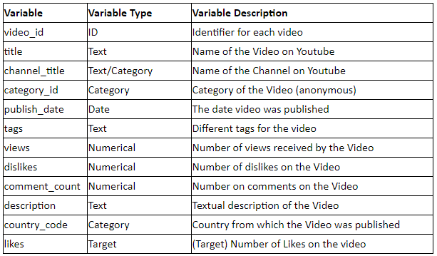
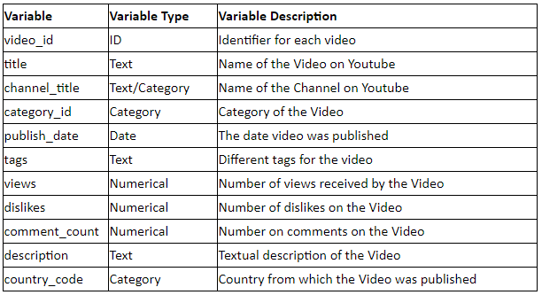

Regression Modelling of Youtube likes
-------------------
* Notebook containing the exploratory data analysis and the modelling used in the Analytics Vidhya Hacklive 2 Hackathon
(https://datahack.analyticsvidhya.com/contest/hacklive-2-guided-community-hackathon/#ProblemStatement)
* The challenge consisted of using the regression models to predict the number of likes a given youtube video 
will get.
* The training set contained the following data:

* The test set looked as follows:

* In the first step, I conducted the Exploratory Data Analysis to gain insight into the provided dataset
* Next, using that new knowledge, I was able to create various new features that improved the quality of predictions
* In my approach to modelling I decided to use various gradient boosting methods like:
    * Extreme Gradient Boosting (XGBoost)
    * Light Gradient Boosting (LightGBM)
    * Catboost
* In the next step I used the obtained predictions to train a new ensemble model to improve the performance.

Installation
-------------------
* Clone this repository to your computer
* Get into the folder using cd Hacklive-Regression
* Install the required libraries using pip install -r requirements.txt

Usage
-------------------
* Open the Hacklive_regression.ipynb file in the jupyter notebook
* In the kernel menu click on 'Restart & run all'
* A preferred method is to use the website https://nbviewer.jupyter.org
* Once there you can just paste the github link to the notebook and it will render it 
